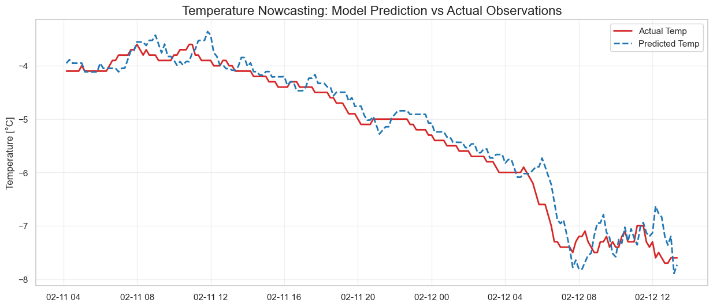
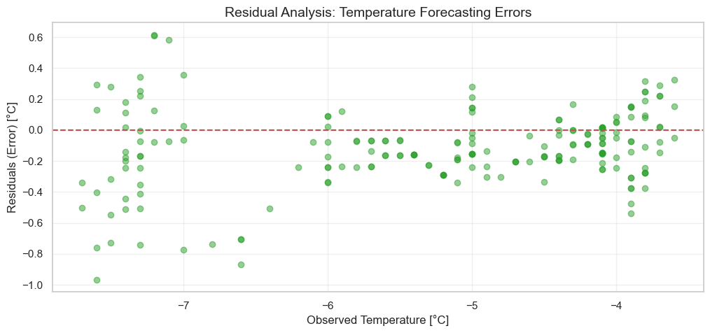

# FMI Weather Data Pipeline & ML Nowcasting Study
### Technical Assessment: Helsinki Kumpula Station Analysis

This repository demonstrates a complete data science pipeline tailored for meteorological applications. It integrates historical data processing with real-time ingestion via the **FMI Open Data WFS API**, culminating in a predictive nowcasting model for surface temperature.

## Project Overview
The goal of this study is to bridge the gap between raw meteorological observations and actionable machine learning insights. The project focuses on the **Helsinki Kumpula station (fmisid: 101004)**, analyzing February 2026 data to understand atmospheric dynamics in high-latitude urban environments.

## Key Visualizations

### 1. Atmospheric Dynamics & Wind Patterns
We utilized polar bar plots (Wind Roses) to identify dominant wind regimes and thermodynamic profiles to correlate air temperature with relative humidity.

*Figure 1: Dominant wind directions and speed distribution at Kumpula station.*

*Figure 2: Surface thermodynamic coupling (Temperature vs. Relative Humidity).*

### 2. Predictive Performance (Nowcasting)
The core of the project is a **Short-term Persistence Model**. By implementing a 1-hour lag feature engineering strategy, the model captures the thermal inertia and synoptic advection dominant in the Finnish winter.

*Figure 3: Temperature Nowcasting performance (1-hour lead time) vs. actual observations.*

## Model Evaluation & Diagnostic
To ensure the reliability of the Linear Regression baseline, a residual analysis was performed.

*Figure 4: Residual scatter plot showing error distribution across the thermal range.*

**Key Finding:** The model maintains high accuracy ($R^2 > 0.90$), although residual analysis reveals a slight overestimation bias during rapid cooling events below -7°C, highlighting the non-linear nature of extreme local cold spells.

## Tech Stack & Methods
- **Data Acquisition:** Programmatic WFS API integration using `fmiopendata`.
- **Feature Engineering:** Temporal lagging (t-1h, t-2h) and barometric trend calculation.
- **Modeling:** Scikit-Learn Linear Regression with chronological time-series splitting.
- **Visualization:** `Matplotlib`, `Seaborn`, and `Windrose` libraries.

